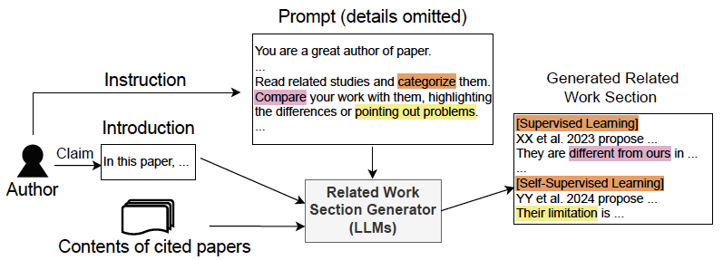

# LLM-based Related Work Section Generation Framework Incorporating Perspectives Researchers Value 

This paper is submitted to ARR 2024 Feb.
Please see the details in the paper.

## Requirement 

### Python environment
We implement the codes in the environment below.

python >= 3.8.4    

    pip install --upgrade pip
    pip install -U openai == 1.8.0

### For running codes
You need API key of ChatGPT.

Please make the following two files at the same directory as README.md:

- env.local
- env.local.org

The formats are provided in .sample files.

### For dataset (Coming soon)
In the dataset, we include the contents which meet the CC4.0 lisence.

If a cited paper is not the case, its title is only provided.

In that case, please manually add the contents.

Adding only abstract also works.

Note that root == target and leaf == cited.

## Usage

An example of the proposed prompt:

    python gen_rw_from_json.py --root_json_name 10

If you would like to try PureGPT case:

    python gen_rw_from_json.py --root_json_name 10 --pure_gpt
    
